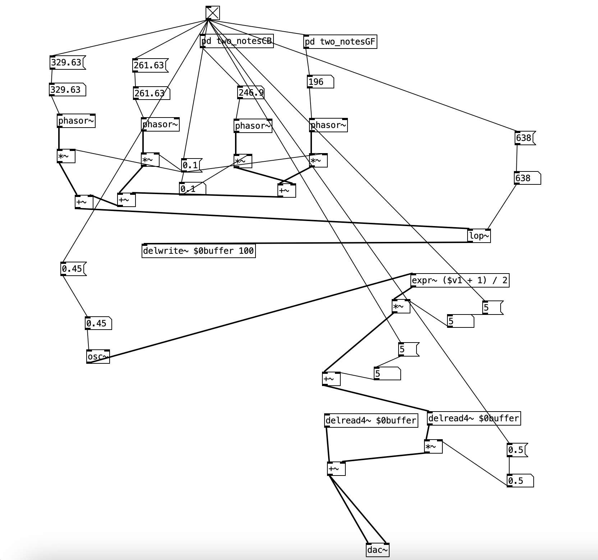

# Homework 1 - Create a Sound Using Additive Synthesis

### Created using: Pure Data

This patch in Pure Data is my attempt to recreate the analog synth pad from the song *The Whistle Song* by **Frankie Knuckles**. Many of the most well-known house songs from the time period (and electronic music in general) of 80s-90s used string synthesizers to create background chords. These string synths were additive synthesizers, many of them using very simple waveshapes like sawtooth waves and/or square waves. As someone who is new to Pure Data, I figured that this would be a good sound to recreate because of its relative simplicity. I created 4 sawtooth oscillators, and matched the frequencies to the 4 note chords in the song.

  

